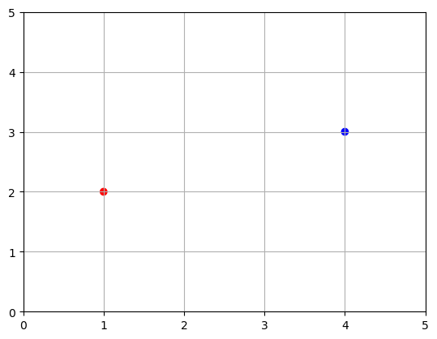
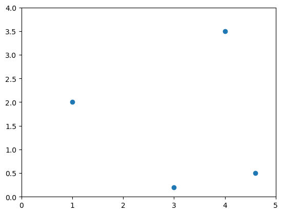

# Linear Algebra for Machine Learning
## Summary Slides

---

## Slide 1: What is Anaconda?

### Anaconda Distribution

**Anaconda** is a popular open-source distribution for Python and R programming, designed for scientific computing and data science.

### Key Features

- **Pre-installed Packages:** 250+ pre-installed data science packages
- **Package Manager:** `conda` - powerful package and environment manager
- **Cross-Platform:** Works on Windows, macOS, and Linux
- **Environment Management:** Create isolated environments for different projects
- **No Administrator Rights:** Can be installed without admin privileges

### Why Use Anaconda?

- Simplifies package installation and dependency management
- Avoids conflicts between different project requirements
- Includes essential libraries: NumPy, Pandas, Matplotlib, Scikit-learn
- Perfect for data science and machine learning workflows

**Official Website:** https://www.anaconda.com/

---

## Slide 2: What is Jupyter Notebook?

### Interactive Computing Environment

**Jupyter Notebook** is an open-source web application that allows you to create and share documents containing:
- Live code
- Equations (LaTeX)
- Visualizations
- Narrative text (Markdown)

### Key Features

- **Cell-based Execution:** Run code in small chunks (cells)
- **Inline Visualizations:** Plots and charts display directly in notebook
- **Multiple Languages:** Supports Python, R, Julia, and more
- **Rich Output:** Images, HTML, videos, custom objects
- **Shareable:** Export to HTML, PDF, slides

### Workflow Benefits

- **Exploratory Analysis:** Test ideas quickly
- **Documentation:** Code + explanations in one place
- **Reproducibility:** Share complete analysis workflow
- **Teaching:** Excellent for tutorials and education

---

## Slide 3: Environment Setup

### Step 1: Install Anaconda

1. Download from: https://www.anaconda.com/download
2. Choose your operating system (Windows/macOS/Linux)
3. Run the installer (recommended: add to PATH)
4. Verify installation: `conda --version`

### Step 2: Create Environment (Optional)

```bash
# Create new environment
conda create -n linear-algebra python=3.9

# Activate environment
conda activate linear-algebra
```

### Step 3: Install Required Libraries

```bash
# If not already installed
conda install numpy matplotlib

# Or using pip
pip install numpy matplotlib
```

### Step 4: Launch Jupyter Notebook

```bash
# Start Jupyter
jupyter notebook

# Browser opens automatically at http://localhost:8888
```

### Step 5: Import Libraries

```python
import numpy as np
import matplotlib.pyplot as plt
```

---

## Slide 4: Introduction - Why Linear Algebra?

### What is Linear Algebra?

**Linear algebra** is a branch of mathematics that is the foundation for many **Machine Learning** and **Deep Learning** algorithms.

### Why is it Important?

- **Fundamental:** Basis for ML/DL algorithms
- **Essential:** Crucial for understanding and working in ML/DL
- **Practical:** Used extensively in data science
- **Powerful:** Enables efficient computation on data

### Key Insight

Good understanding of linear algebra is **essential** for:
- Understanding machine learning algorithms
- Implementing ML/DL models
- Debugging and optimizing models
- Reading research papers

---

## Slide 5: Linear Algebra in Machine Learning

### Where Linear Algebra is Used

**1. Datasets**
- Data represented as matrices
- Rows = samples, Columns = features
- Essential for data manipulation

**2. Images**
- Images as 2D matrices (grayscale) or 3D tensors (RGB)
- Pixel values stored in arrays
- Image processing operations

**3. Encoding**
- Text and categorical data → numerical vectors
- One-hot encoding, word embeddings
- Feature representation

---

**4. Recommendation Systems**
- User-item interaction matrices
- Matrix factorization techniques
- Collaborative filtering

**5. Deep Learning**
- Neural network weights as matrices
- Forward/backward propagation = matrix operations
- Activation functions applied to vectors/matrices

**6. Other Applications**
- Principal Component Analysis (PCA)
- Linear regression
- Support Vector Machines (SVM)
- And many more!

---

## Slide 6: Fundamental Objects of Linear Algebra

### Three Core Objects

Linear algebra operations are performed on three types of mathematical objects:

1. **Scalars**
   - Single numbers
   - Example: 5, 3.14, -2

2. **Vectors**
   - 1D arrays of numbers
   - Example: [1, 2, 3, 4]

3. **Matrices**
   - 2D arrays of numbers
   - Example: [[1, 2], [3, 4]]

4. **Tensors** (Extension)
   - N-dimensional arrays
   - Generalization of matrices to higher dimensions

---

## Slide 7: Scalars

### Definition

A **scalar** is a single number, a zero-dimensional object.

### Examples

```python
import numpy as np

x = 1.0
y = 1

print(np.isscalar(x))  # True
print(np.isscalar(y))  # True
```

### Properties

- **Dimensionality:** 0-dimensional
- **Representation:** Just a value
- **Operations:** Basic arithmetic (+, -, ×, ÷)

### Use Cases

- Learning rates in ML
- Regularization parameters
- Thresholds
- Constants in equations

---

## Slide 8: Vectors

### Definition

A **vector** is a **one-dimensional array** of single numbers.

### Creating Vectors

**Python list:**
```python
v = [0, 1, 2, 3, 4, 5, 6, 7, 8, 9]
```

**NumPy array:**
```python
x = np.arange(10)
# array([0, 1, 2, 3, 4, 5, 6, 7, 8, 9])

y = np.array([0, 1, 2, 3, 4, 5, 6, 7, 8, 9])

z = np.array([10, 20, 30])
```

---

### Vector Properties

**Size:**
```python
print(x.size)  # 10
```

**Indexing:**
```python
print(x[0])  # 1st element: 0
print(x[1])  # 2nd element: 1
print(x[9])  # 10th element: 9
```

**Mathematical Notation:**
- i-th element of vector **v** is denoted as: **v**ᵢ
- Indices in math usually start from 1
- Indices in programming start from 0

---

## Slide 9: Visualizing Vectors

### 2D Vector Plotting

```python
import matplotlib.pyplot as plt

u = np.array([1, 2])
v = np.array([4, 3])

# Plot as points
x_coords, y_coords = zip(u, v)
plt.scatter(x_coords, y_coords)
plt.axis([0, 5, 0, 5])
plt.grid()
plt.show()
```



---

### Vectors as Arrows

```python
def plot_vector2d(vector2d, origin=[0, 0], **options):
    return plt.arrow(origin[0], origin[1],
                     vector2d[0], vector2d[1],
                     head_width=0.2, head_length=0.3,
                     length_includes_head=True, **options)

plot_vector2d(u, color="r")
plot_vector2d(v, color="b")
plt.axis([0, 5, 0, 5])
plt.grid()
plt.show()
```


**Vectors have both magnitude (length) and direction**

---

## Slide 10: Matrices

### Definition

A **matrix** is a **two-dimensional array** of numbers arranged in rows and columns.

### Creating Matrices

**From nested lists:**
```python
A = np.array([[1, 2, 3],
              [4, 5, 6]])
print(A)
# [[1 2 3]
#  [4 5 6]]
```

**Using NumPy functions:**
```python
# All zeros
B = np.zeros((2, 3))

# All ones
C = np.ones((3, 2))

# Identity matrix
I = np.eye(3)
```

---

### Matrix Properties

**Shape (dimensions):**
```python
A.shape  # (2, 3) - 2 rows, 3 columns
```

**Size (total elements):**
```python
A.size   # 6 elements
```

**Indexing:**
```python
A[0, 0]  # First row, first column: 1
A[1, 2]  # Second row, third column: 6
```

**Slicing:**
```python
A[:, 0]   # First column: [1, 4]
A[0, :]   # First row: [1, 2, 3]
A[:, 1:3] # Columns 1-2
```

---

### Matrix Notation

**Mathematical notation:**
- Matrix **A** with m rows and n columns: **A** ∈ ℝᵐˣⁿ
- Element at row i, column j: **A**ᵢⱼ

**Example:**
```
A = [[a₁₁  a₁₂  a₁₃]
     [a₂₁  a₂₂  a₂₃]]
```

**Dimensions:**
- **Row vector:** 1 × n matrix
- **Column vector:** m × 1 matrix
- **Square matrix:** m × m matrix (m = n)

---

## Slide 11: Visualizing Matrices

### Matrix as Heatmap

```python
A = np.array([[1, 2, 3],
              [4, 5, 6],
              [7, 8, 9]])

plt.imshow(A, cmap='viridis', interpolation='nearest')
plt.colorbar()
plt.title('Matrix Visualization')
plt.show()
```



### Applications

- **Images:** Pixels as matrix values
- **Data:** Rows = samples, columns = features
- **Transformations:** Rotation, scaling, translation
- **Neural Networks:** Weight matrices

---

## Slide 12: Tensors

### Definition

A **tensor** is an **n-dimensional array**, a generalization of matrices to higher dimensions.

### Tensor Hierarchy

- **0D tensor** = Scalar (single number)
- **1D tensor** = Vector (array)
- **2D tensor** = Matrix (table)
- **3D tensor** = Cube of numbers
- **4D+ tensors** = Higher-dimensional structures

---

### Creating Tensors

```python
# 3D tensor
T = np.array([[[1, 2],
               [3, 4]],
              [[5, 6],
               [7, 8]]])

print(T.shape)  # (2, 2, 2)
print(T.ndim)   # 3 dimensions
```

---

### Tensor Applications

**3D Tensors:**
- RGB images (height × width × 3 channels)
- Time series data (samples × timesteps × features)
- Video frames

**4D Tensors:**
- Batch of RGB images (batch × height × width × channels)
- Video clips (samples × frames × height × width)

**5D+ Tensors:**
- Video datasets with multiple clips
- Medical imaging (3D scans over time)

---

## Slide 13: Scalar Operations on Vectors

### Definition

Operations between a **scalar** and each element of a **vector**.

### Addition

```python
v = np.array([1, 2, 3, 4])
s = 10

result = v + s
# array([11, 12, 13, 14])
```

---

### Other Scalar Operations

**Subtraction:**
```python
v - 5
# array([-4, -3, -2, -1])
```

**Multiplication:**
```python
v * 2
# array([2, 4, 6, 8])
```

**Division:**
```python
v / 2
# array([0.5, 1., 1.5, 2.])
```

**Key Point:** Scalar is broadcast to each element

---

## Slide 14: Vector Addition

### Definition

Adding corresponding elements of two vectors of the **same size**.

### Operation

```python
a = np.array([1, 2, 3])
b = np.array([4, 5, 6])

c = a + b
# array([5, 7, 9])
```

**Element-wise:**
```
[1]   [4]   [1+4]   [5]
[2] + [5] = [2+5] = [7]
[3]   [6]   [3+6]   [9]
```

---

### Properties

**Requirement:** Vectors must have the **same length**

**Commutative:** **a** + **b** = **b** + **a**

**Associative:** (**a** + **b**) + **c** = **a** + (**b** + **c**)

### Visualization

```python
u = np.array([2, 1])
v = np.array([1, 3])
w = u + v

# Plot vectors and their sum
```


**Geometric interpretation:** Place vectors tip-to-tail

---

## Slide 15: Vector Subtraction

### Definition

Subtracting corresponding elements of two vectors.

### Operation

```python
a = np.array([10, 20, 30])
b = np.array([5, 10, 15])

c = a - b
# array([5, 10, 15])
```

**Element-wise:**
```
[10]   [5]    [10-5]    [5]
[20] - [10] = [20-10] = [10]
[30]   [15]   [30-15]   [15]
```

---

### Geometric Interpretation

```python
u = np.array([3, 2])
v = np.array([1, 3])
w = u - v  # array([2, -1])
```


**Interpretation:** Vector from tip of **v** to tip of **u**

---

## Slide 16: Vector Multiplication (Element-wise)

### Hadamard Product

Multiply corresponding elements of two vectors (element-wise).

### Operation

```python
a = np.array([1, 2, 3])
b = np.array([4, 5, 6])

c = a * b
# array([4, 10, 18])
```

**Element-wise:**
```
[1]   [4]   [1×4]   [4]
[2] × [5] = [2×5] = [10]
[3]   [6]   [3×6]   [18]
```

**Note:** This is NOT the same as dot product!

---

## Slide 17: Vector Division

### Element-wise Division

Divide corresponding elements of two vectors.

### Operation

```python
a = np.array([10, 20, 30])
b = np.array([2, 4, 5])

c = a / b
# array([5., 5., 6.])
```

**Element-wise:**
```
[10]   [2]   [10/2]   [5]
[20] ÷ [4] = [20/4] = [5]
[30]   [5]   [30/5]   [6]
```

**Caution:** Avoid division by zero!

---

## Slide 18: Dot Product (Inner Product)

### Definition

Sum of the products of corresponding elements.

### Operation

```python
a = np.array([1, 2, 3])
b = np.array([4, 5, 6])

dot_product = np.dot(a, b)
# or
dot_product = a @ b
# Result: 32
```

**Calculation:**
```
a · b = (1×4) + (2×5) + (3×6)
      = 4 + 10 + 18
      = 32
```

---

### Properties

**Commutative:** **a** · **b** = **b** · **a**

**Distributive:** **a** · (**b** + **c**) = **a** · **b** + **a** · **c**

**Result:** Always a scalar (single number)

### Geometric Meaning

```
a · b = |a| × |b| × cos(θ)
```

Where:
- |**a**| = length of **a**
- |**b**| = length of **b**
- θ = angle between vectors

**Interpretation:** Measures how aligned two vectors are

---

## Slide 19: Scalar Operations on Matrices

### Definition

Operations between a scalar and each element of a matrix.

### Addition

```python
A = np.array([[1, 2, 3],
              [4, 5, 6]])
s = 10

result = A + s
# [[11 12 13]
#  [14 15 16]]
```

---

### Other Operations

**Subtraction:**
```python
A - 5
# [[-4 -3 -2]
#  [-1  0  1]]
```

**Multiplication:**
```python
A * 2
# [[ 2  4  6]
#  [ 8 10 12]]
```

**Division:**
```python
A / 2
# [[0.5 1.  1.5]
#  [2.  2.5 3. ]]
```

---

## Slide 20: Matrix Addition

### Definition

Adding corresponding elements of two matrices of the **same dimensions**.

### Operation

```python
A = np.array([[1, 2],
              [3, 4]])

B = np.array([[5, 6],
              [7, 8]])

C = A + B
# [[ 6  8]
#  [10 12]]
```

**Element-wise:**
```
[1 2]   [5 6]   [1+5 2+6]   [6  8]
[3 4] + [7 8] = [3+7 4+8] = [10 12]
```

---

### Properties

**Requirement:** Matrices must have **same shape**

**Commutative:** **A** + **B** = **B** + **A**

**Associative:** (**A** + **B**) + **C** = **A** + (**B** + **C**)

**Identity:** **A** + **0** = **A** (zero matrix)

---

## Slide 21: Matrix Subtraction

### Definition

Subtracting corresponding elements of two matrices.

### Operation

```python
A = np.array([[10, 20],
              [30, 40]])

B = np.array([[5, 10],
              [15, 20]])

C = A - B
# [[ 5 10]
#  [15 20]]
```

**Element-wise:**
```
[10 20]   [5  10]   [10-5  20-10]   [5  10]
[30 40] - [15 20] = [30-15 40-20] = [15 20]
```

---

## Slide 22: Matrix Multiplication (Element-wise)

### Hadamard Product

Multiply corresponding elements (NOT standard matrix multiplication).

### Operation

```python
A = np.array([[1, 2],
              [3, 4]])

B = np.array([[5, 6],
              [7, 8]])

C = A * B  # Element-wise
# [[ 5 12]
#  [21 32]]
```

**Element-wise:**
```
[1 2]   [5 6]   [1×5 2×6]   [5  12]
[3 4] × [7 8] = [3×7 4×8] = [21 32]
```

**Note:** This is the Hadamard product, NOT matrix multiplication!

---

## Slide 23: Matrix Division

### Element-wise Division

```python
A = np.array([[10, 20],
              [30, 40]])

B = np.array([[2, 4],
              [5, 10]])

C = A / B
# [[ 5.  5.]
#  [ 6.  4.]]
```

**Element-wise:**
```
[10 20]   [2  4]    [10/2 20/4]   [5  5]
[30 40] ÷ [5  10] = [30/5 40/10] = [6  4]
```

---

## Slide 24: Matrix Multiplication (Dot Product)

### True Matrix Multiplication

The **standard** matrix multiplication operation.

### Operation

```python
A = np.array([[1, 2],
              [3, 4]])  # 2×2

B = np.array([[5, 6],
              [7, 8]])  # 2×2

C = np.dot(A, B)
# or
C = A @ B

# [[19 22]
#  [43 50]]
```

---

### Calculation

**Rule:** Row of A × Column of B

```
C[0,0] = (1×5) + (2×7) = 5 + 14 = 19
C[0,1] = (1×6) + (2×8) = 6 + 16 = 22
C[1,0] = (3×5) + (4×7) = 15 + 28 = 43
C[1,1] = (3×6) + (4×8) = 18 + 32 = 50
```

---

### Requirements

**Shape compatibility:**
- **A** has shape (m, n)
- **B** has shape (n, p)
- **C** = **A** × **B** has shape (m, p)

**Key:** Number of columns in **A** must equal number of rows in **B**

**Not commutative:** **A** × **B** ≠ **B** × **A** (in general)

---

## Slide 25: Matrix-Vector Multiplication

### Definition

Multiply a matrix by a vector (special case of matrix multiplication).

### Operation

```python
A = np.array([[1, 2, 3],
              [4, 5, 6]])  # 2×3

v = np.array([7, 8, 9])   # 3×1 (column vector)

result = np.dot(A, v)
# or
result = A @ v

# array([50, 122])
```

---

### Calculation

```
[1 2 3]   [7]   [(1×7)+(2×8)+(3×9)]   [50]
[4 5 6] × [8] = [(4×7)+(5×8)+(6×9)] = [122]
          [9]
```

**Result:** Vector with length equal to number of rows in matrix

### Applications

- Linear transformations
- Neural network layers
- Linear equations: **A****x** = **b**

---

## Slide 26: Tensor Arithmetic

### Tensor Operations

Similar to vectors and matrices, but in higher dimensions.

### Tensor Addition

```python
A = np.array([[[1, 2], [3, 4]],
              [[5, 6], [7, 8]]])  # 2×2×2

B = np.array([[[1, 1], [1, 1]],
              [[1, 1], [1, 1]]])

C = A + B
# [[[2 3]
#   [4 5]]
#  [[6 7]
#   [8 9]]]
```

**Element-wise addition across all dimensions**

---

## Slide 27: Tensor Subtraction

### Operation

```python
A = np.array([[[10, 20], [30, 40]],
              [[50, 60], [70, 80]]])

B = np.array([[[5, 10], [15, 20]],
              [[25, 30], [35, 40]]])

C = A - B
# [[[5  10]
#   [15 20]]
#  [[25 30]
#   [35 40]]]
```

**Element-wise subtraction across all dimensions**

---

## Slide 28: Tensor Multiplication & Division

### Element-wise Multiplication

```python
A = np.array([[[1, 2], [3, 4]],
              [[5, 6], [7, 8]]])

B = np.array([[[2, 2], [2, 2]],
              [[2, 2], [2, 2]]])

C = A * B
# [[[2  4]
#   [6  8]]
#  [[10 12]
#   [14 16]]]
```

---

### Element-wise Division

```python
C = A / B
# [[[0.5 1. ]
#   [1.5 2. ]]
#  [[2.5 3. ]
#   [3.5 4. ]]]
```

**All operations are element-wise in higher dimensions**

---

## Slide 29: Key Concepts Summary

### Fundamental Objects

| Object | Dimensions | Example | Shape |
|--------|------------|---------|-------|
| **Scalar** | 0D | 5 | () |
| **Vector** | 1D | [1, 2, 3] | (3,) |
| **Matrix** | 2D | [[1,2], [3,4]] | (2, 2) |
| **Tensor** | 3D+ | [[[1,2]], [[3,4]]] | (2, 1, 2) |

---

### Operations Summary

| Operation | Symbol | Result Type |
|-----------|--------|-------------|
| **Vector Addition** | **a** + **b** | Vector |
| **Vector Dot Product** | **a** · **b** | Scalar |
| **Matrix Multiplication** | **A** × **B** | Matrix |
| **Element-wise Mult.** | **A** ⊙ **B** | Same shape |
| **Matrix-Vector Mult.** | **A****v** | Vector |

---

## Slide 30: Linear Algebra in NumPy - Cheat Sheet

### Basic Operations

```python
# Dot product
np.dot(a, b)
a @ b

# Matrix multiplication
np.matmul(A, B)
A @ B

# Element-wise multiplication
A * B

# Transpose
A.T

# Inverse
np.linalg.inv(A)

# Determinant
np.linalg.det(A)
```

---

### Advanced Operations

```python
# Eigenvalues and eigenvectors
eigenvalues, eigenvectors = np.linalg.eig(A)

# Singular Value Decomposition
U, S, Vt = np.linalg.svd(A)

# Solve linear system Ax = b
x = np.linalg.solve(A, b)

# Matrix rank
rank = np.linalg.matrix_rank(A)

# Norm
norm = np.linalg.norm(v)

# Trace
trace = np.trace(A)
```

---

## Slide 31: Common Linear Algebra Applications

### Machine Learning

**1. Linear Regression**
- Solve: **X**ᵀ**X****w** = **X**ᵀ**y**
- Find weights **w** using matrix operations

**2. Principal Component Analysis (PCA)**
- Eigenvalue decomposition of covariance matrix
- Dimensionality reduction

**3. Neural Networks**
- Forward pass: **y** = **W****x** + **b**
- Backpropagation: gradient calculations using matrix operations

---

### Data Processing

**4. Data Normalization**
- Standardization: (**X** - μ) / σ
- Min-max scaling: (**X** - min) / (max - min)

**5. Distance Calculations**
- Euclidean distance
- Cosine similarity
- Mahalanobis distance

**6. Transformations**
- Rotation matrices
- Scaling
- Translation

---

## Slide 32: Best Practices

### Numerical Stability

✓ **Check for invertibility** before inverting matrices
```python
if np.linalg.det(A) != 0:
    A_inv = np.linalg.inv(A)
```

✓ **Use appropriate data types**
```python
A = np.array([[1, 2], [3, 4]], dtype=np.float64)
```

✓ **Check dimensions** before operations
```python
assert A.shape[1] == B.shape[0], "Incompatible shapes"
```

---

### Performance Tips

✓ **Vectorize operations** (avoid loops)
```python
# Slow
for i in range(n):
    result[i] = A[i] * B[i]

# Fast
result = A * B
```

✓ **Use appropriate operations**
```python
# For dot product, use:
np.dot(a, b)  # or a @ b
# NOT:
np.sum(a * b)  # Slower
```

---

## Slide 33: Resources & Next Steps

### Documentation

**NumPy Linear Algebra:**
https://numpy.org/doc/stable/reference/routines.linalg.html

**SciPy Linear Algebra:**
https://docs.scipy.org/doc/scipy/reference/linalg.html

---

### Recommended Books

- "Linear Algebra and Its Applications" by Gilbert Strang
- "Introduction to Linear Algebra" by Gilbert Strang
- "Mathematics for Machine Learning" by Deisenroth, Faisal, Ong

---

### Online Courses

- MIT OCW: Linear Algebra (Gilbert Strang)
- Khan Academy: Linear Algebra
- Coursera: Mathematics for Machine Learning Specialization

---

### Practice

1. Implement linear regression from scratch
2. Code PCA algorithm
3. Build a simple neural network layer
4. Solve systems of linear equations
5. Compute eigenvalues/eigenvectors manually
6. Implement matrix decompositions (LU, QR, SVD)

---

## Slide 34: Advanced Topics to Explore

### Matrix Decompositions

- **LU Decomposition**
- **QR Decomposition**
- **Singular Value Decomposition (SVD)**
- **Cholesky Decomposition**
- **Eigenvalue Decomposition**

### Special Matrices

- **Orthogonal Matrices**
- **Symmetric Matrices**
- **Positive Definite Matrices**
- **Sparse Matrices**

### Applications

- **Graph Theory** (adjacency matrices)
- **Computer Graphics** (transformations)
- **Optimization** (gradient descent)
- **Signal Processing** (Fourier transforms)

---

## Thank You!

### Key Takeaways

✓ **Linear algebra is fundamental** to machine learning
✓ **Scalars, vectors, matrices, tensors** are core objects
✓ **Operations:** Addition, multiplication, dot product
✓ **NumPy provides efficient** implementations
✓ **Understanding shapes** is crucial for debugging

### Continue Learning!

**Linear algebra is everywhere in ML/DL:**
- Data representation
- Model parameters
- Forward/backward propagation
- Optimization algorithms
- Dimensionality reduction

---

### Questions?

**Happy Computing with Linear Algebra!**

*Remember: Linear algebra is the language of machine learning - master it and you'll understand ML at a deeper level!*
